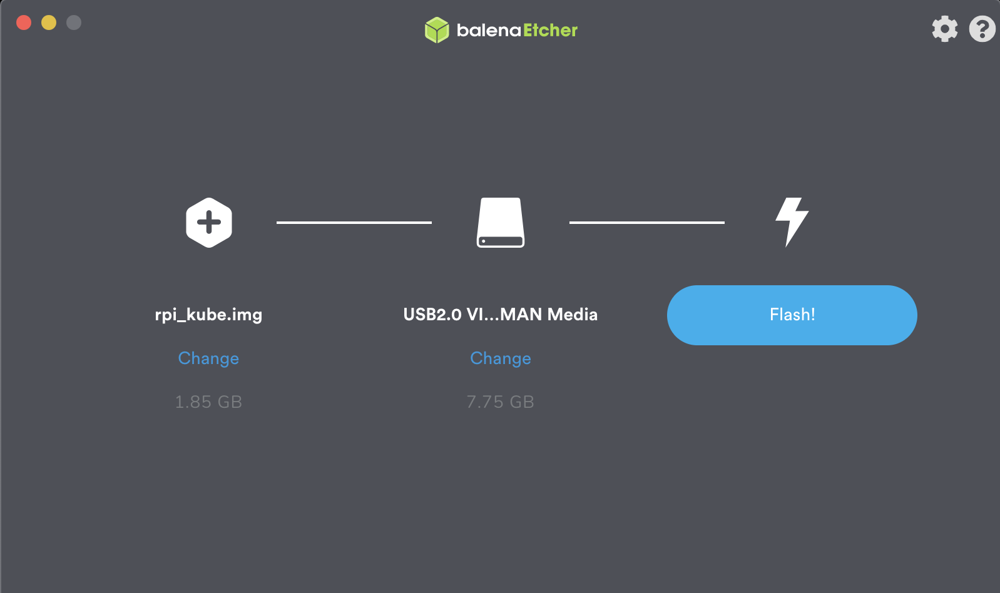

# Kuberenetes cluster on RaspberryPi the DevOps way

This repo installs [K3S](https://k3s.io) kubernetes cluster on 3 raspberry pi computers. I used recent raspberry pi model (4B) for this demo but you can install it on almost all modern raspberry pi models. (RPi 2,3 and 4)

We'd like to use DevOps/Cloud tools such as `docker`, `packer` and `ansible` to make it cool like we are running the cluster on our own home private cloud ;-) 

## Build the raspberry pi image

We're going to build rapsberry pi images by `packer` using [packer-builder-arm-image](pyguy/packer-builder-arm-image) repo.

### Docker

Clone [packer-builder-arm-image](pyguy/packer-builder-arm-image) repository:

   `git clone github.com/pyguy/packer-builder-arm-image`

Build the docker image:
    
```bash
cd packer-builder-arm-image/

docker build -t packer-builder-arm:latest .
```
Run the docker container to build the raspberry pi image:

```bash
cd packer/

docker run \
  --rm \
  --privileged \
  -v ${PWD}:/build:rw \
  -v ${HOME}/.ssh:/build/.ssh:ro \
  -v ${PWD}/packer_cache:/build/packer_cache \
  -v ${PWD}/output-arm-image:/build/output-arm-image \
  packer-builder-arm build raspbian_kube.json
```
The image will be place on `output-arm-image` directory.

**Note**: Your default public key will be added to the image, to add any custom public key to the image add the following variable to the above command:
`-var ssh_key_src=<custom public key file>`

## Setup the SD card
 The following section is going to be used for all the nodes in the cluser. So let's do it one by one:

### Flashing the SD card
I use [Etcher](https://www.balena.io/etcher/) for flashing the SD-cards. Just select the image file we built on `output-arm-image/rpi_kube.img`, and insert your SD-card, select the drive, and click “Flash!”. That's easy!

